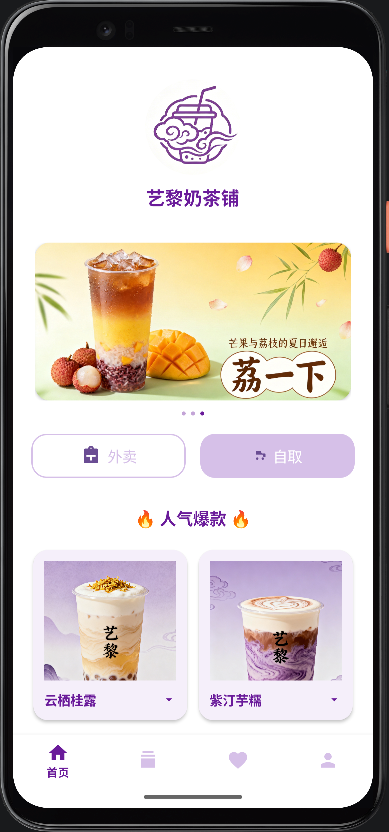
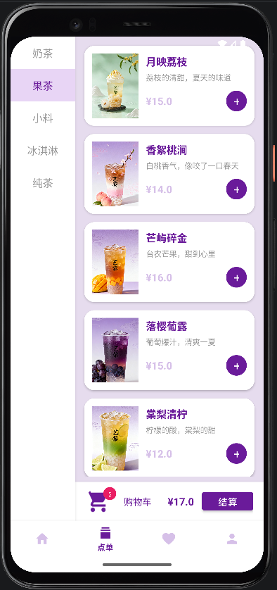
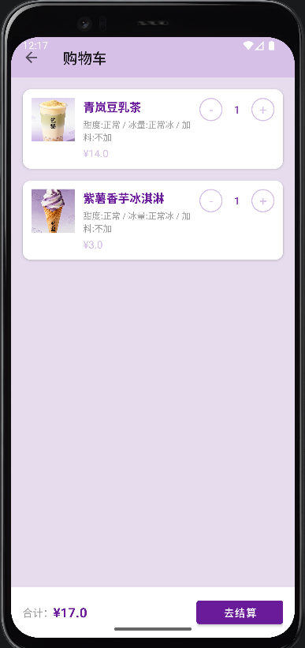
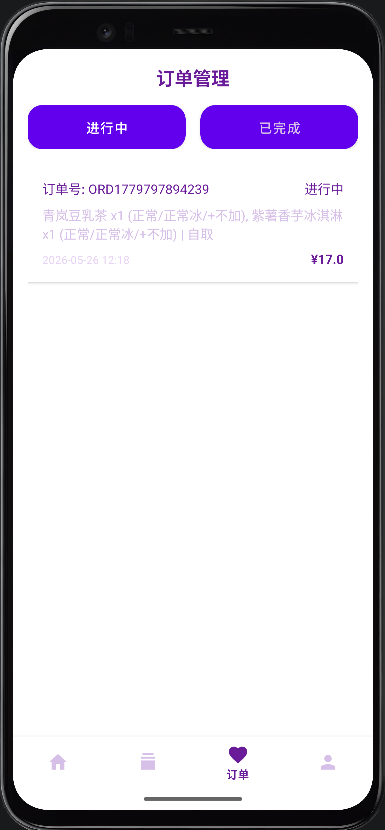
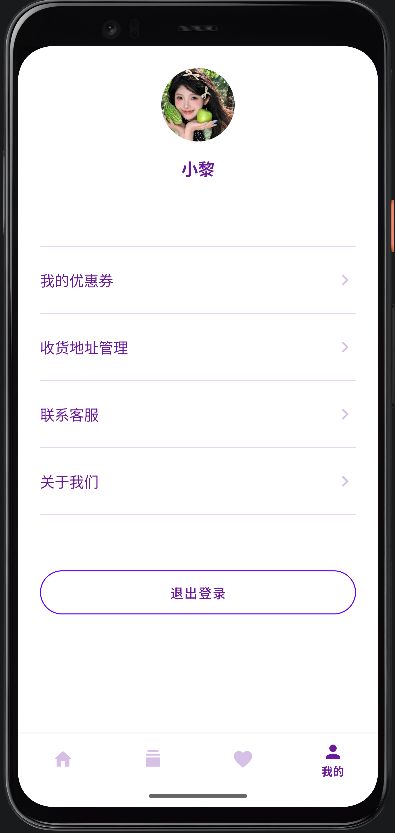
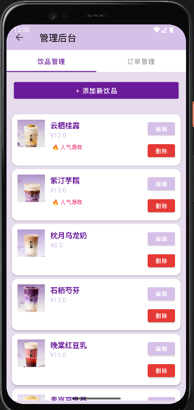

# 基于Android的奶茶饮品点单系统设计与实现


---

## 📱 项目简介

**艺黎奶茶铺** 是一款基于 Android 平台开发的奶茶饮品点单系统。用户可以通过 APP 浏览饮品、下单购买、管理订单，管理员可以在后台管理饮品的上架与订单状态。

本系统采用纯本地架构，所有数据存储在手机本地数据库中，无需联网即可使用。

### ✨ 核心功能

#### 👤 用户端

| 功能模块 | 功能描述 |
|---------|---------|
| 用户注册/登录 | 支持新用户注册，已有用户登录 |
| 首页展示 | 店标展示、Banner轮播图、爆款饮品推荐 |
| 点单功能 | 左侧分类栏（奶茶/果茶/小料/冰淇淋/纯茶），右侧商品列表 |
| 饮品规格选择 | 甜度（正常/少糖/半糖）、冰量（正常冰/少冰/去冰）、加料（珍珠/椰果） |
| 购物车管理 | 查看已选商品、修改数量、删除商品 |
| 订单提交 | 支持自取/外卖两种模式，外卖需填写收货地址 |
| 订单管理 | 查看进行中/已完成的订单，实时同步订单状态 |
| 收货地址管理 | 添加、编辑、删除收货地址，支持设为默认地址 |
| 优惠券系统 | 八折优惠券领取与使用 |
| 离线AI客服 | 基于关键词匹配的智能问答，无需网络 |

#### 👨‍💼 管理员端

| 功能模块 | 功能描述 |
|---------|---------|
| 饮品管理 | 添加、编辑、删除饮品（名称、价格、分类、图片、标签） |
| 订单管理 | 查看所有用户的订单，可将“进行中”订单标记为“已完成” |

---

## 🛠 技术栈

| 分类 | 技术 |
|------|------|
| 开发语言 | Java |
| UI 框架 | Android 原生 + Material Design |
| 数据库 | SQLite (Room) |
| 本地存储 | SharedPreferences |
| 图片加载 | 原生 ImageView + CircleImageView |
| 二维码生成 | ZXing Core |
| JSON 解析 | Gson |
| 构建工具 | Gradle (Kotlin DSL) |
| 最低 SDK | API 24 (Android 7.0) |
| 目标 SDK | API 34 (Android 14) |

---

## 📁 项目结构

```
app/src/main/
├── java/com/example/yl_app/
│   ├── adapters/              # RecyclerView 适配器
│   │   ├── BannerAdapter.java
│   │   ├── ChatAdapter.java
│   │   ├── DrinkAdapter.java
│   │   ├── HotDrinkAdapter.java
│   │   ├── OrderAdapter.java
│   │   └── ...
│   ├── database/              # Room 数据库
│   │   ├── AddressDao.java
│   │   ├── AddressEntity.java
│   │   ├── DrinkDao.java
│   │   ├── DrinkDatabase.java
│   │   ├── DrinkEntity.java
│   │   ├── OrderDao.java
│   │   ├── OrderEntity.java
│   │   ├── UserDao.java
│   │   └── UserEntity.java
│   ├── models/                # 数据模型类
│   │   ├── CartItem.java
│   │   ├── ChatMessage.java
│   │   └── DrinkItem.java
│   ├── ui/                    # 界面层
│   │   ├── address/           # 地址管理
│   │   ├── admin/             # 管理员后台
│   │   ├── about/             # 关于我们
│   │   ├── cart/              # 购物车
│   │   ├── chat/              # AI 客服
│   │   ├── checkout/          # 结算页面
│   │   ├── home/              # 首页
│   │   ├── login/             # 登录注册
│   │   ├── menu/              # 点单页面
│   │   ├── order/             # 订单页面
│   │   └── profile/           # 个人中心
│   ├── utils/                 # 工具类
│   │   ├── CartManager.java
│   │   └── DatabaseHelper.java
│   └── MainActivity.java      # 主入口
├── res/
│   ├── drawable/              # 图片资源
│   ├── layout/                # 布局文件
│   ├── menu/                  # 菜单文件
│   ├── mipmap/                # 应用图标
│   └── values/                # 颜色、字符串、样式
└── AndroidManifest.xml        # 应用配置文件
```

---

## 🚀 快速开始

### 环境要求

| 工具 | 版本要求 |
|------|---------|
| Android Studio | Ladybug (2024.2.1) 或更高 |
| JDK | 17 |
| Android SDK | API 34 |
| Gradle | 8.5+ |

### 运行步骤

1. **克隆项目**
```bash
git clone https://github.com/你的用户名/你的仓库名.git
```

2. **用 Android Studio 打开**
   - File → Open → 选择项目文件夹

3. **同步 Gradle**
   - 点击 **Sync Now**

4. **连接设备**
   - 连接 Android 手机（开启开发者模式/USB调试）
   - 或创建并启动模拟器

5. **运行**
   - 点击 **Run** 按钮（绿色三角形）

---

## 👤 默认账号

| 角色 | 用户名 | 密码 | 说明 |
|------|--------|------|------|
| 管理员 | admin | 123456 | 可管理饮品和订单 |
| 普通用户 | test | 123456 | 普通点单用户 |

> 普通用户需在登录页面点击「注册」创建新账号，然后再登陆

---

## 📸 界面预览

| 首页 | 点单页面 | 购物车 |
|------|---------|--------|
|  |  |  |

| 订单页面 | 个人中心 | 管理员后台 |
|---------|---------|-----------|
|  |  |  |

> 📌 截图需自行添加到 `screenshots/` 文件夹

---

## 📖 功能演示

### 👤 用户端流程

1. 注册/登录账号
2. 在「点单」页面浏览饮品
3. 点击「+」选择甜度/冰量/加料，加入购物车
4. 进入购物车确认商品，点击「去结算」
5. 选择自取或外卖模式（外卖模式需选择收货地址）
6. 选择支付方式（微信/支付宝）
7. 确认支付，订单生成（状态：进行中）
8. 在「订单」页面查看订单状态

### 👨‍💼 管理员端流程

1. 使用 `admin / 123456` 登录
2. 进入「饮品管理」Tab：可添加、编辑、删除饮品
3. 进入「订单管理」Tab：查看所有订单，点击「完成」标记订单

---

## 🎨 界面设计规范

### 配色方案

| 颜色名称 | 色值 | 用途 |
|---------|------|------|
| 主背景 | #E9DFF7 | 全屏渐变底色 |
| 选中按钮 | #A87FD8 | 按钮选中状态 |
| 文字深紫 | #6A4C93 | 商品名称 |
| 文字白色 | #FFFFFF | 店名、按钮文字 |
| 卡片浅紫 | #F5EFFA | 商品卡片底色 |
| 标签粉色 | #E91E63 | 人气爆款标签 |
| 标签紫色 | #9C27B0 | 新品标签 |

### 设计风格

- 主色调：浅香芋紫渐变
- 风格：极简国风，圆角设计（16px）
- 布局：对标市面主流奶茶APP

---

## 🗄️ 数据库设计

### 表结构说明

**用户表（users）**

| 字段名 | 类型 | 说明 |
|-------|------|------|
| id | INTEGER | 主键，自增 |
| username | TEXT | 用户名，唯一 |
| password | TEXT | 密码 |
| role | TEXT | 角色（admin/user） |

**饮品表（drinks）**

| 字段名 | 类型 | 说明 |
|-------|------|------|
| id | INTEGER | 主键，自增 |
| name | TEXT | 饮品名称 |
| category | TEXT | 分类 |
| price | REAL | 价格 |
| imageName | TEXT | 图片文件名 |
| slogan | TEXT | 广告词 |
| tag | TEXT | 标签 |
| isHot | INTEGER | 是否爆款 |

**订单表（orders）**

| 字段名 | 类型 | 说明 |
|-------|------|------|
| id | INTEGER | 主键，自增 |
| orderId | TEXT | 订单号 |
| date | TEXT | 下单时间 |
| status | TEXT | 状态 |
| total | REAL | 总金额 |
| items | TEXT | 商品清单 |
| userId | TEXT | 下单用户ID |

**地址表（addresses）**

| 字段名 | 类型 | 说明 |
|-------|------|------|
| id | INTEGER | 主键，自增 |
| userId | TEXT | 用户ID |
| name | TEXT | 收货人姓名 |
| phone | TEXT | 联系电话 |
| address | TEXT | 详细地址 |
| isDefault | INTEGER | 是否默认地址 |

---

## 📄 开源协议

本项目采用 MIT 协议开源。

```
MIT License

Copyright (c) 2025 艺黎奶茶铺

Permission is hereby granted, free of charge, to any person obtaining a copy
of this software and associated documentation files (the "Software"), to deal
in the Software without restriction, including without limitation the rights
to use, copy, modify, merge, publish, distribute, sublicense, and/or sell
copies of the Software, and to permit persons to whom the Software is
furnished to do so, subject to the following conditions:

The above copyright notice and this permission notice shall be included in all
copies or substantial portions of the Software.

THE SOFTWARE IS PROVIDED "AS IS", WITHOUT WARRANTY OF ANY KIND, EXPRESS OR
IMPLIED, INCLUDING BUT NOT LIMITED TO THE WARRANTIES OF MERCHANTABILITY,
FITNESS FOR A PARTICULAR PURPOSE AND NONINFRINGEMENT. IN NO EVENT SHALL THE
AUTHORS OR COPYRIGHT HOLDERS BE LIABLE FOR ANY CLAIM, DAMAGES OR OTHER
LIABILITY, WHETHER IN AN ACTION OF CONTRACT, TORT OR OTHERWISE, ARISING FROM,
OUT OF OR IN CONNECTION WITH THE SOFTWARE OR THE USE OR OTHER DEALINGS IN THE
SOFTWARE.
```

---

## 👨‍💻 作者

| 项目 | 信息 |
|------|------|
| 项目名称 | 基于Android的奶茶饮品点单系统设计与实现 |
| 开发团队 | 艺黎 |
| GitHub | [你的GitHub主页](https://github.com/zjq-yl) |
| 项目地址 | [GitHub仓库链接](https://github.com/zjq-yl/yili-tea-ordering-system) |

---

## 🙏 致谢

- Material Design - Google 设计规范
- CircleImageView - 圆形图片库
- Room Database - Android 官方数据库
- ZXing Core - 二维码生成库
- Gson - JSON 解析库
- shields.io - 项目徽章生成

---

---

*最后更新：2025年5月*
```